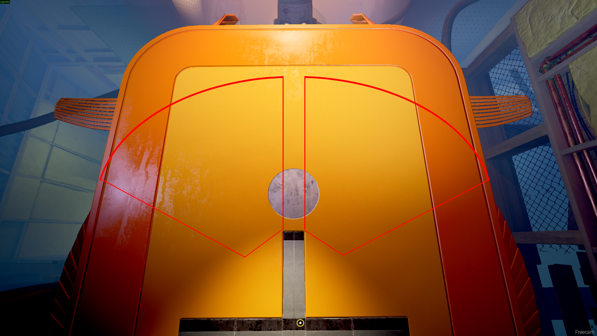

import {YouTube} from 'mdx-embed';

# Biting the Dust

## BTD Wall Climb
A Tutorial that covers the Wall Climb and a few alternativ strats. There are more alternatives especially to get out of bounds at the start. You can find them in the knowledge section.
<YouTube youTubeId="XIEG81TQk78"/>
 
Image of checkpoint box at the end of the wall climb.

## Boss fight

If you rcped to get the second player up in the previous section you should be on 30 FPS already. If you were together, you can rcp the moment you load into the actual fight to then switch to 30 FPS. Now the fight starts with a bomb phase.

### Bomb phases

Every bomb phase the boss is gonna shot 5 Bombs at each player. Then you can suck them up and fire them back at the boss. If you don't lose any bombs and do this phase twice you'll hit the boss with 20 bombs bringing him down to zero hp and starting the last phase.

:::easy
Place all bombs on one side of the arena without stacking them. Crouch walking gives a pretty good spacing.
The image isn't 100% accurate.

<YouTube youTubeId="syjOUiO6GlU"/>
:::

:::hard
If you place all bombs very tightly together in a line along the area that would suck up the bombs without you touching the tube, you can just bump into the side of the tube and move it that way saving 1 second. On higher ping you can place bombs further away as higher ping increases the movement of the tube from the bump.
<YouTube youTubeId="62fWnnxejAw"/>
:::

### Dodge phase

After the first bomb phase the Boss slams his arms onto the floor generating shockwaves. He does one with both arms and then six alternating between the arms, starting with his left arm. After that it transitions into another bomb phase. If you don't hit the boss with 20 bombs in 2 phases, you will see some other versions of the dodge phase but you shouldn't ever need to go trough one of those.

### Final phase
This is the phase we switch to 30 FPS for as getting the arms up to the boss is faster on 30 FPS. Once you grapped an arm you want to hold up left or up right towards the boss on keyboard. Controllers diagonal input is a tiny bit slower.

This concludes Biting the Dust