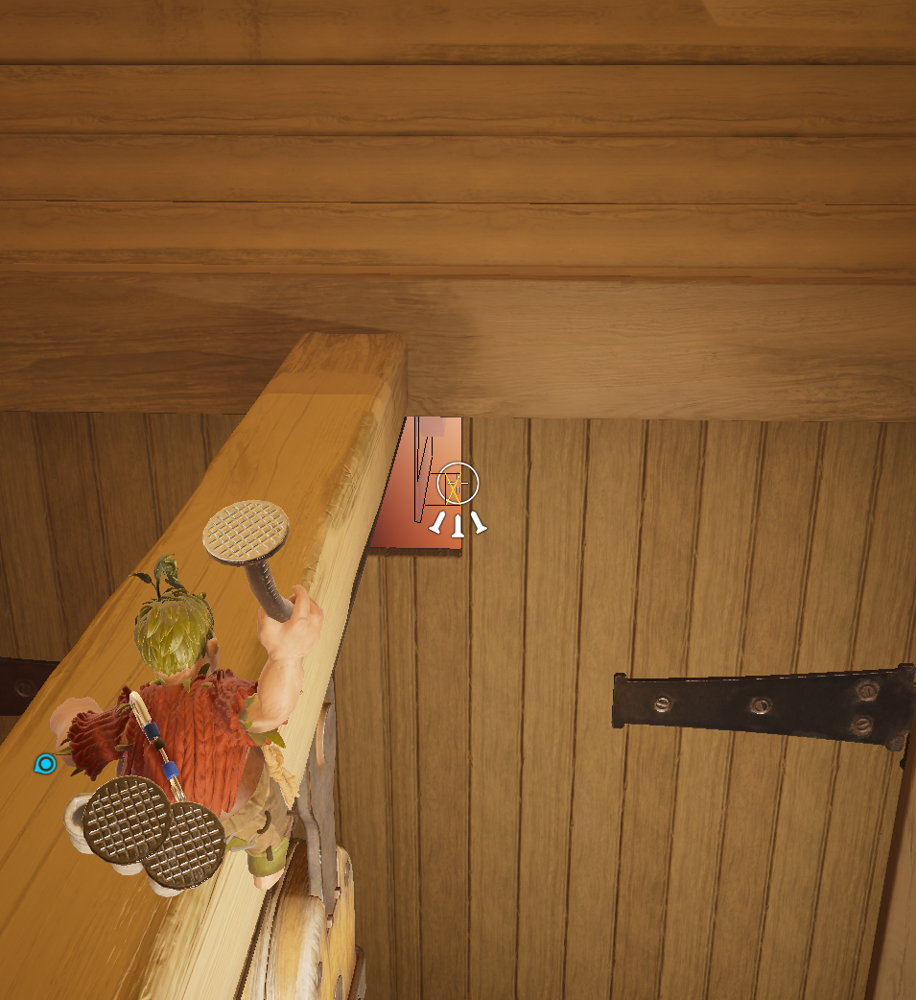

import {YouTube} from 'mdx-embed';

# The Depths

## Beginning OOB Explantion

<Either>

This route covers the basics to help you get you through the section. Refer to the knowledge tab on this section for more information about the different routes that exist
<YouTube youTubeId="Q_qCzKKbwbA"/>

</Either>

## Boss Skip

<Cody>

### Nails Routes

:::easy
<YouTube youTubeId="pz5MPJ9c1T0"/>
:::

:::hard
<YouTube youTubeId="RkZ5fevDqyc"/>
:::

### Boss Kill

:::info
Aiming with the nails prevents Cody from falling off the edges of platforms. Use this to help lineup your aim by positioning Cody as far right of the Beam as possible.
:::

Visual lineup to find & shoot the boss hitbox

</Cody>