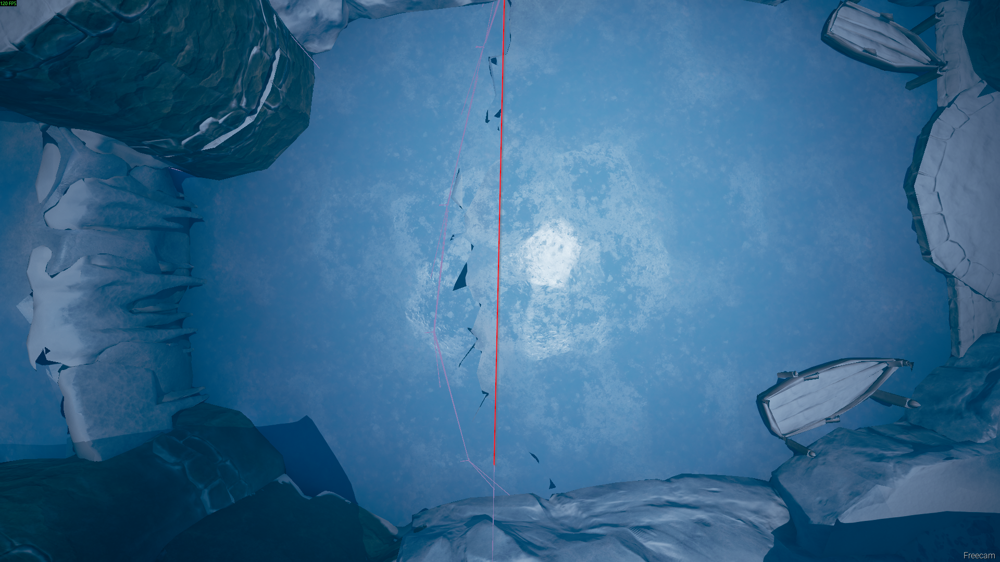

import {YouTube} from 'mdx-embed';

# Warming Up

First rcp to skip the intro cutscene.

## Geting OOB
:::medium
Precise jumps, double jumps and dashes.
<YouTube youTubeId="RjtKXxfP1v0"/>
:::

:::hard
A Snuggleslide which is the fastest but hardest way
<YouTube youTubeId="nGfdNbtcXVw"/>
:::

## OOB to Ice

:::easy Basic movement and route
<YouTube youTubeId="kkan2LnU_7A"/>
:::

:::medium Advanced chainslidejumps
<YouTube youTubeId="3TmzhKO-bn4"/>
:::

:::caution
Don't hit the volume may stands on and Cody looks at as it will send you to the right. You shouldn't get there and there is no good backup so for more info you gonna have to look at the knowledge tab.

:::

## Finnishing from Ice

:::note
Make sure to check out the movment guide in the knowledge tab for the best ice movement.
:::

The route
<YouTube youTubeId="vl4je1fU1t0"/>
 

Potential ice boosts
<YouTube youTubeId="zrCGyTXtL7c"/>

You should rcp to teleport forward at this red line in the ending room. Both players are required.

You finnish it of by pulling the lever and rcping again to skip another cutscene.
